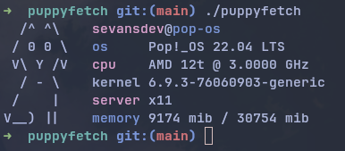

# puppyfetch
puppyfetch is a system fetch for some Linux distributions.



# Building 
```sh
$ git clone https://github.com/makichiis/puppyfetch.git 
$ cd puppyfetch 
$ make 
```

# Installing 
```sh
$ sudo make install
```
